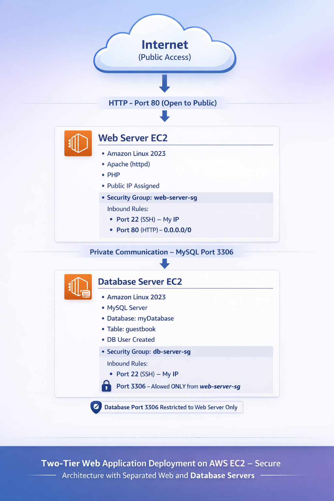

#AWS Two-Tier Architecture Diagram

This project follows a secure Two-Tier Architecture model where the Web Server and Database Server are deployed on separate EC2 instances.

------------------------------------------------------------

##Architecture Overview

Internet (Public Users)
        ↓
Web Server EC2 (Apache + PHP)
        ↓ (Private IP Communication)
Database EC2 (MySQL)

------------------------------------------------------------

##Architecture Components

###Internet Layer
• Public users access the application via HTTP (Port 80)
• Only Web Server is publicly accessible

------------------------------------------------------------

###Web Server EC2

Instance Name: web-server-ec2  
AMI: Amazon Linux 2023  

Installed Services:
• Apache (httpd)
• PHP
• MySQL PHP Driver (php-mysqlnd)

Security Group: web-server-sg  

Inbound Rules:
• Port 22 (SSH) → My IP only
• Port 80 (HTTP) → 0.0.0.0/0

Purpose:
• Hosts the Guestbook web application
• Handles user requests
• Connects to Database via private IP

------------------------------------------------------------

###Database Server EC2

Instance Name: db-server-ec2  
AMI: Amazon Linux 2023  

Installed Services:
• MySQL Server

Database:
• myDatabase
• guestbook table

Security Group: db-server-sg  

Inbound Rules:
• Port 22 (SSH) → My IP only
• Port 3306 (MySQL) → Allowed ONLY from web-server-sg

Purpose:
• Stores application data securely
• Not publicly accessible
• Only Web Server can communicate with it

------------------------------------------------------------

##Security Design

• Database is not exposed to the public internet
• MySQL Port 3306 is restricted to Web Server Security Group
• SSH access limited to trusted IP
• Separation of application and database improves security and scalability

------------------------------------------------------------

##Architecture Flow

1. User accesses the Web Application via public IP.
2. Request reaches Web Server EC2 on Port 80.
3. Web Server processes request using PHP.
4. PHP connects to Database EC2 using private IP.
5. MySQL stores or retrieves data.
6. Response is sent back to user.

------------------------------------------------------------

##Architecture Type

This is a classic Two-Tier Architecture:

Presentation Layer → Web Server  
Data Layer → Database Server  

This model is commonly used in real-world production environments.
